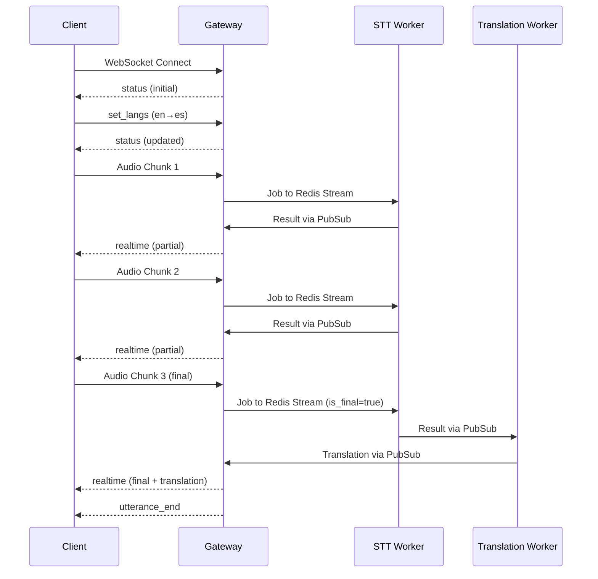

# API Reference

Complete reference for WebSocket API, HTTP endpoints, and message formats used in the speech transcription microservices.

## 🌐 WebSocket API

### Connection Details

- **URL**: `ws://localhost:5026` (development) / `wss://your-domain.com:5026` (production)
- **Protocol**: WebSocket with JSON messages
- **Authentication**: None required (open-source version)

### Client → Gateway Messages

#### Audio Data (Binary)
```javascript
// Binary message format:
// [4 bytes: metadata length][JSON metadata][audio data]

const metadata = {
  sampleRate: 16000  // Audio sample rate in Hz
};

const metadataJson = JSON.stringify(metadata);
const metadataLength = new Uint32Array([metadataJson.length]);
const metadataBytes = new TextEncoder().encode(metadataJson);

// Combine: metadataLength + metadataBytes + audioData
const message = new Uint8Array([
  ...new Uint8Array(metadataLength.buffer),
  ...metadataBytes,
  ...audioData
]);

websocket.send(message);
```

#### Language Settings (JSON)
```javascript
websocket.send(JSON.stringify({
  type: "set_langs",
  source_language: "en",  // Source language code
  target_language: "vi"   // Target language code
}));
```

#### Status Request (JSON)
```javascript
websocket.send(JSON.stringify({
  type: "get_status"
}));
```

#### Start Over Command (JSON)
```javascript
websocket.send(JSON.stringify({
  type: "start_over"
}));
```

### Gateway → Client Messages

#### Initial Status (JSON)
```javascript
{
  "type": "status",
  "client_id": "client_123abc45",
  "source_language": "en",
  "target_language": "vi",
  "translation_enabled": true
}
```

#### Status Update (JSON)
```javascript
{
  "type": "status",
  "client_id": "client_123abc45",
  "source_language": "es",
  "target_language": "fr",
  "translation_enabled": true
}
```

#### Real-time Transcription (JSON)
```javascript
{
  "type": "realtime",
  "text": "Hello world",
  "translation": "Hola mundo",
  "is_final": false,
  "client_id": "client_123abc45",
  "timestamp": 1640995200.123
}
```

#### Utterance End Signal (JSON)
```javascript
{
  "type": "utterance_end",
  "client_id": "client_123abc45",
  "timestamp": 1640995200.456
}
```

## 📊 HTTP Endpoints

### Health Check Endpoints

#### Gateway Health
```
GET /health
```

**Response:**
```json
{
  "status": "healthy",
  "instance_id": "gateway-001",
  "timestamp": 1640995200.789,
  "clients_connected": 3,
  "jobs_processed": 150,
  "uptime_seconds": 3600,
  "redis_connected": true,
  "active_sessions": 2
}
```

#### STT Worker Health
```
GET /health
```

**Response:**
```json
{
  "status": "healthy",
  "instance_id": "stt-001",
  "timestamp": 1640995200.789,
  "model_loaded": true,
  "model_size": "base",
  "device": "cpu",
  "jobs_processed": 42,
  "uptime_seconds": 1800,
  "redis_connected": true,
  "active_jobs": 0
}
```

#### Translation Worker Health
```
GET /health
```

**Response:**
```json
{
  "status": "healthy",
  "instance_id": "translation-001",
  "timestamp": 1640995200.789,
  "model_loaded": true,
  "model_name": "opus-mt",
  "device": "cpu",
  "jobs_processed": 38,
  "uptime_seconds": 1800,
  "redis_connected": true,
  "memory_usage_mb": 256
}
```

### Metrics Endpoints

#### Detailed Metrics
```
GET /metrics
```

**Gateway Metrics:**
```json
{
  "instance_id": "gateway-001",
  "timestamp": 1640995200.789,
  "clients_connected": 3,
  "total_clients_served": 150,
  "jobs_sent": 500,
  "results_received": 495,
  "errors": 2,
  "uptime_seconds": 3600,
  "redis_operations": 1200,
  "audio_bytes_processed": 5242880,
  "avg_processing_latency_ms": 45.2
}
```

**STT Worker Metrics:**
```json
{
  "instance_id": "stt-001",
  "timestamp": 1640995200.789,
  "jobs_processed": 42,
  "successful_transcriptions": 40,
  "failed_transcriptions": 2,
  "avg_transcription_time_ms": 1200,
  "model_inference_time_ms": 950,
  "audio_duration_processed_seconds": 1680,
  "memory_peak_mb": 2048,
  "gpu_utilization_percent": 0,
  "redis_operations": 84
}
```

**Translation Worker Metrics:**
```json
{
  "instance_id": "translation-001",
  "timestamp": 1640995200.789,
  "jobs_processed": 38,
  "successful_translations": 36,
  "failed_translations": 2,
  "avg_translation_time_ms": 150,
  "text_chars_processed": 125000,
  "memory_peak_mb": 512,
  "cache_hit_ratio": 0.75,
  "redis_operations": 76
}
```

## 🔄 Message Flow Examples

### Complete Transcription Session



### Language Switching Mid-Session

```mermaid
sequenceDiagram
    participant Client
    participant Gateway

    Client->>Gateway: set_langs (en→fr)
    Gateway-->>Client: status (updated)

    Client->>Gateway: Audio Chunk
    Gateway->>STT Worker: Job with lang settings
    Note right: Future transcriptions use new languages
```

## 📋 Supported Languages

### Source Languages (Transcription)
- `en` - English
- `es` - Spanish
- `fr` - French
- `de` - German
- `vi` - Vietnamese
- `zh` - Chinese
- `ja` - Japanese
- `hi` - Hindi

### Target Languages (Translation)
- `en` - English
- `es` - Spanish
- `fr` - French
- `de` - German
- `vi` - Vietnamese
- `zh` - Chinese
- `ja` - Japanese
- `hi` - Hindi

## ⚠️ Error Handling

### WebSocket Errors
- **Connection Closed**: Automatic reconnection recommended
- **Invalid Message Format**: Log error, continue processing
- **Audio Processing Error**: Log error, send error status if critical

### HTTP Error Responses
```json
{
  "status": "unhealthy",
  "error": "Redis connection failed",
  "instance_id": "gateway-001",
  "timestamp": 1640995200.000
}
```

## 🔧 Development Testing

### JavaScript Client Example
```javascript
// Connect to WebSocket
const ws = new WebSocket('ws://localhost:5026');

// Handle incoming messages
ws.onmessage = (event) => {
  const data = JSON.parse(event.data);
  console.log('Received:', data);

  switch(data.type) {
    case 'status':
      console.log('Status update:', data);
      break;
    case 'realtime':
      console.log('Transcription:', data.text);
      console.log('Translation:', data.translation);
      break;
    case 'utterance_end':
      console.log('Utterance ended');
      break;
  }
};

// Send language settings
ws.send(JSON.stringify({
  type: 'set_langs',
  source_language: 'en',
  target_language: 'es'
}));

// Send audio data (simplified)
const audioData = getAudioChunk();
const metadata = { sampleRate: 16000 };
const metadataJson = JSON.stringify(metadata);
const metadataLength = new Uint32Array([metadataJson.length]);

ws.send(new Uint8Array([
  ...new Uint8Array(metadataLength.buffer),
  ...new TextEncoder().encode(metadataJson),
  ...audioData
]));
```

### Python Client Example
```python
import asyncio
import websockets
import json
import struct

async def test_client():
    async with websockets.connect('ws://localhost:5026') as websocket:
        # Handle incoming messages
        async for message in websocket:
            if isinstance(message, str):
                data = json.loads(message)
                print(f"Received: {data}")
            else:
                print(f"Received binary data: {len(message)} bytes")

        # Send language settings
        await websocket.send(json.dumps({
            'type': 'set_langs',
            'source_language': 'en',
            'target_language': 'vi'
        }))

        # Send audio data (simplified)
        audio_data = b'your_audio_bytes_here'
        metadata = {'sampleRate': 16000}
        metadata_json = json.dumps(metadata).encode('utf-8')
        metadata_length = struct.pack('<I', len(metadata_json))

        message = metadata_length + metadata_json + audio_data
        await websocket.send(message)

asyncio.run(test_client())
```

## 🚀 Production Considerations

### Connection Limits
- **Concurrent Connections**: Scale Gateway instances horizontally
- **Message Rate Limiting**: Implement per-client rate limits
- **Binary Message Size**: Maximum recommended: 64KB per message
- **Connection Timeout**: Implement ping/pong for connection health

### Monitoring
- Monitor WebSocket connection counts
- Track message throughput and latency
- Alert on high error rates
- Log suspicious message patterns

### Security
- Implement connection rate limiting
- Validate message formats strictly
- Use WSS in production (WebSocket Secure)
- Consider message encryption for sensitive data
