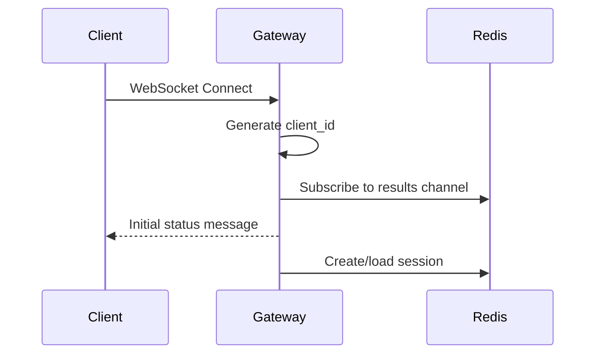
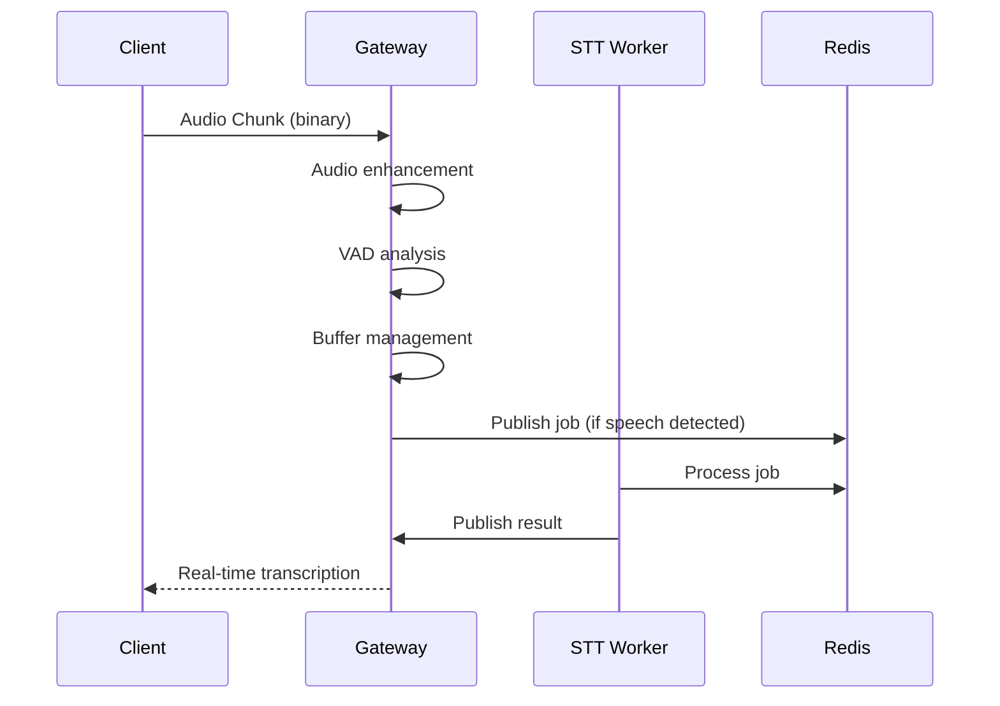
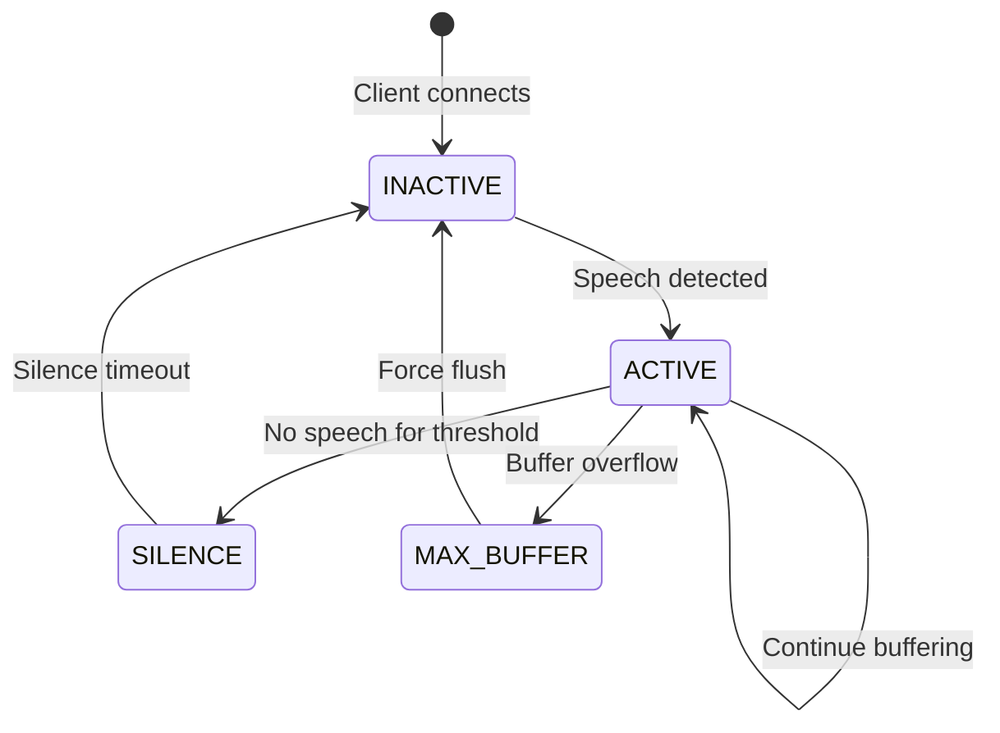

# Gateway Service Documentation

Complete guide to the WebSocket Gateway service - the entry point for all client connections in the speech transcription microservices architecture.

## 🎯 Overview

The Gateway service acts as the central hub for the speech transcription system. It handles WebSocket client connections, processes audio streams, manages session state, and orchestrates the flow of data between clients and worker services.

```
┌─────────────┐    ┌─────────────┐    ┌─────────────┐
│   Clients   │────│   Gateway   │────│    Redis    │
│ (WebSocket) │    │ (WebSocket) │    │ (Streams +  │
│             │    │  + Audio    │    │  Pub/Sub)   │
└─────────────┘    └─────────────┘    └─────────────┘
                                │
                                ▼
                    ┌─────────────────────┐
                    │   Worker Services   │
                    │ (STT + Translation) │
                    └─────────────────────┘
```

## 🚀 Key Features

- **WebSocket Server**: Handles real-time bidirectional communication
- **Dual VAD System**: WebRTC + Silero for robust speech detection
- **Session Management**: Redis-backed session persistence for scaling
- **Audio Processing**: Real-time audio chunking and enhancement
- **Flow Control**: Prevents job flooding with per-client rate limiting
- **Language Support**: Dynamic source/target language configuration
- **Event-Driven**: Publishes to Redis Streams, subscribes to results
- **Health Monitoring**: Comprehensive metrics and health endpoints

## 🏗️ Architecture

### Core Components

#### WebSocket Handler (`websocket_handler.py`)
- Manages individual client connections
- Processes incoming audio and text messages
- Handles client lifecycle (connect/disconnect/cleanup)

#### Gateway Service (`gateway.py`)
- Main orchestration logic
- Audio buffer management and speech detection
- Redis integration for messaging and session storage
- Flow control and job-in-flight tracking

#### Audio Processor (`audio_processor.py`)
- Audio enhancement and resampling
- Quality improvements for better transcription
- Format conversion and normalization

#### Session Management (`session.py`)
- Client session state persistence
- Language settings and buffer management
- Speech session lifecycle handling

#### VAD Integration (`vad.py`)
- Dual voice activity detection
- WebRTC for fast detection, Silero for accuracy
- Speech state transitions and buffering

## 🔄 Message Flow

### Client Connection Flow



### Audio Processing Flow



### Speech Session Lifecycle



## 🎛️ Configuration

### Environment Variables

| Variable | Default | Description |
|----------|---------|-------------|
| `GATEWAY_PORT` | `5026` | WebSocket server port |
| `HEALTH_PORT` | `8080` | HTTP health/metrics port |
| `REDIS_URL` | `redis://localhost:6379` | Redis connection URL |
| `LOG_LEVEL` | `INFO` | Logging verbosity |

### Audio Processing Settings

| Variable | Default | Description |
|----------|---------|-------------|
| `SAMPLE_RATE` | `16000` | Target audio sample rate |
| `BUFFER_SIZE` | `4096` | Audio processing buffer size |
| `PRE_SPEECH_BUFFER_SECONDS` | `1.0` | Pre-speech audio to retain |

### Voice Activity Detection

| Variable | Default | Description |
|----------|---------|-------------|
| `WEBRTC_SENSITIVITY` | `3` | WebRTC VAD sensitivity (0-3) |
| `SILERO_SENSITIVITY` | `0.7` | Silero VAD sensitivity (0.0-1.0) |
| `SILENCE_THRESHOLD_SECONDS` | `2.0` | Silence before ending speech |

### Performance Tuning

| Variable | Default | Description |
|----------|---------|-------------|
| `MAX_QUEUE_DEPTH` | `100` | Maximum Redis queue depth |
| `MAX_AUDIO_BUFFER_SECONDS` | `30.0` | Maximum audio buffer duration |

## 📊 Key Algorithms

### Dual Voice Activity Detection

The Gateway uses two VAD systems for robust speech detection:

#### WebRTC VAD (Fast, Lightweight)
- **Purpose**: Real-time speech detection
- **Sensitivity**: 0-3 (higher = more sensitive)
- **Pros**: Low latency, low CPU usage
- **Cons**: Less accurate for quiet speech

#### Silero VAD (Accurate, Neural)
- **Purpose**: High-accuracy speech detection
- **Sensitivity**: 0.0-1.0 (higher = more sensitive)
- **Pros**: Better accuracy, handles noise better
- **Cons**: Higher latency, more CPU intensive

#### Combined Approach
```python
# WebRTC for fast detection
if webrtc_vad.is_speech(audio_chunk):
    # Silero for confirmation
    if silero_vad.is_speech(audio_chunk):
        activate_speech_buffer()
```

### Audio Buffer Management

#### Pre-Speech Buffering
Maintains a rolling buffer of audio before speech detection to capture words that start before VAD triggers.

```python
# Rolling buffer: last N seconds of audio
pre_speech_buffer = collections.deque(maxlen=pre_speech_seconds * sample_rate)

# When speech detected, prepend buffer
speech_audio = pre_speech_buffer + current_audio
```

#### Speech Session States

| State | Description | Actions |
|-------|-------------|---------|
| `INACTIVE` | No speech detected | Monitor for speech start |
| `ACTIVE` | Speech in progress | Buffer audio, send jobs |
| `SILENCE` | Speech ended, waiting | Continue monitoring |
| `MAX_BUFFER` | Buffer overflow | Force final job send |

### Flow Control

Prevents job flooding by tracking jobs-in-flight per client:

```python
# Per-client flow control
job_in_flight[client_id] = False

# Only send new job if previous completed
if not job_in_flight[client_id]:
    send_job_to_workers(audio_chunk)
    job_in_flight[client_id] = True
```

## 🔧 Development and Testing

### Local Development
```bash
# Start with hot reload
cd backend/infra
make up

# View gateway logs
make logs

# Test WebSocket connection
curl -I http://localhost:8080/health
```

### Testing Audio Flow
```bash
# Use terminal client
cd backend/terminal_run
python live_transcription.py

# Check Redis streams
docker-compose exec redis redis-cli xlen audio_jobs
```

### Debugging Commands
```bash
# Monitor active connections
docker-compose logs -f gateway | grep "Client.*connected"

# Check buffer sizes
docker-compose logs -f gateway | grep "Buffer's current size"

# Monitor job flow
docker-compose logs -f gateway | grep "Sent job\|Received from"
```

## 📈 Monitoring and Metrics

### Health Endpoints

#### `/health`
```json
{
  "status": "healthy",
  "instance_id": "gateway-001",
  "clients_connected": 3,
  "jobs_processed": 150,
  "redis_connected": true
}
```

#### `/metrics`
```json
{
  "clients_connected": 3,
  "total_clients_served": 150,
  "jobs_sent": 500,
  "results_received": 495,
  "audio_bytes_processed": 5242880,
  "avg_processing_latency_ms": 45.2,
  "errors": 2
}
```

### Key Metrics to Monitor

- **Connection Count**: Active WebSocket connections
- **Job Throughput**: Jobs sent/received per second
- **Latency**: Time from audio receipt to result delivery
- **Buffer Health**: Average buffer sizes and overflow events
- **Error Rates**: Failed connections, processing errors

## 🚀 Scaling and Performance

### Horizontal Scaling
```bash
# Scale gateway instances
docker-compose up --scale gateway=3

# Load balancer distributes connections
# Redis handles session sharing
```

### Performance Optimization

#### Memory Management
- Buffer size limits prevent memory exhaustion
- Session cleanup on client disconnect
- Efficient audio processing with numpy arrays

#### CPU Optimization
- Async processing prevents blocking
- Thread pool for audio enhancement
- Flow control prevents job queue backup

#### Network Optimization
- Binary WebSocket messages for audio
- Compressed JSON for metadata
- Connection pooling for Redis

## 🐛 Troubleshooting

### Common Issues

#### High Latency
```
Symptoms: Slow transcription response
Solutions:
- Check Redis performance: docker stats
- Monitor buffer sizes: logs show "Buffer's current size"
- Scale STT workers: docker-compose up --scale stt_worker=3
```

#### Connection Drops
```
Symptoms: Clients disconnecting frequently
Solutions:
- Check WebSocket ping/pong
- Monitor server resources
- Review error logs for connection issues
```

#### Buffer Overflows
```
Symptoms: "Exceeded MAX_AUDIO_BUFFER_SECONDS"
Solutions:
- Increase MAX_AUDIO_BUFFER_SECONDS
- Check VAD sensitivity settings
- Scale gateway instances
```

#### Redis Connection Issues
```
Symptoms: "Redis connection failed"
Solutions:
- Check Redis health: docker-compose ps redis
- Verify REDIS_URL configuration
- Check network connectivity
```

### Debug Logging

Enable detailed logging:
```bash
export LOG_LEVEL=DEBUG
make restart
```

Key debug messages:
- `[GATEWAY INITIALIZATION]` - Configuration dump
- `Voice detected, activating buffer` - Speech start
- `Buffer's current size: X.XX` - Buffer monitoring
- `Sent job (X.XX/Y.YYs)` - Job publishing
- `Received from STT_WORKER` - Result processing

## 🔧 Extending the Gateway

### Adding New Message Types
```python
# In websocket_handler.py
elif msg_type == "new_feature":
    await self._handle_new_feature(data, client_id, websocket)
```

### Custom Audio Processing
```python
# In audio_processor.py
def custom_enhancement(self, audio_data, sample_rate):
    # Apply custom audio processing
    return enhanced_audio
```

### Additional VAD Systems
```python
# In vad.py
class CustomVAD:
    def is_speech(self, audio_chunk):
        # Implement custom VAD logic
        return speech_detected
```

## 📚 Related Documentation

- **[QUICK_START.md](../QUICK_START.md)** - Get running quickly
- **[CONFIGURATION.md](../CONFIGURATION.md)** - All configuration options
- **[API_REFERENCE.md](../API_REFERENCE.md)** - WebSocket message formats
- **[DEVELOPMENT_SETUP.md](../DEVELOPMENT_SETUP.md)** - Development environment
- **[SHARED_MODULES.md](../SHARED_MODULES.md)** - Common utilities
