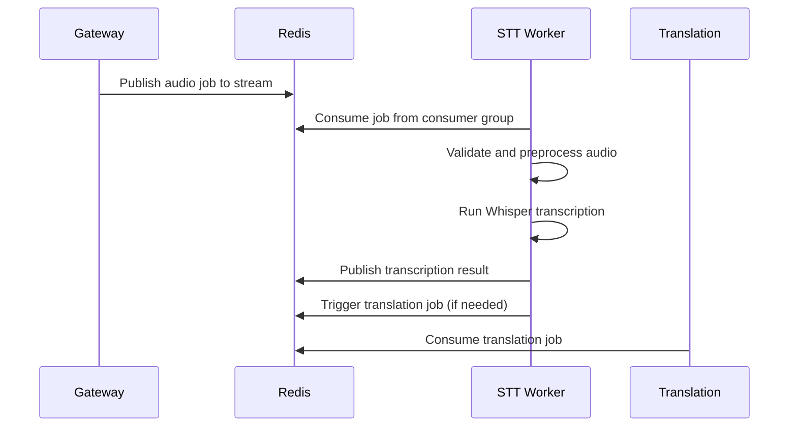

# STT Worker Documentation

Complete guide to the Speech-to-Text (STT) worker service - the core transcription engine using Faster-Whisper models.

## 🎯 Overview

The STT Worker is responsible for transcribing audio chunks into text using advanced machine learning models. It consumes audio jobs from Redis Streams, processes them with Faster-Whisper, and publishes transcription results back through Redis Pub/Sub.

```
┌─────────────┐    ┌─────────────┐    ┌─────────────┐
│   Gateway   │────│    Redis    │────│ STT Worker  │
│ (Audio Jobs)│    │  (Streams)  │    │ (Whisper)   │
└─────────────┘    └─────────────┘    └─────────────┘
                                              │
                                              ▼
                                 ┌─────────────────────┐
                                 │   Transcription     │
                                 │     Results        │
                                 └─────────────────────┘
```

## 🚀 Key Features

- **Faster-Whisper Integration**: State-of-the-art transcription accuracy
- **GPU Acceleration**: CUDA support for high-performance inference
- **Horizontal Scaling**: Consumer groups for load distribution
- **Batch Processing**: Configurable batch sizes for optimization
- **Model Management**: Automatic model loading and caching
- **Health Monitoring**: Comprehensive metrics and status reporting
- **Error Handling**: Robust failure recovery and retry logic
- **VAD Filtering**: Optional voice activity detection preprocessing

## 🏗️ Architecture

### Core Components

#### Worker Service (`worker.py`)
- Main orchestration and job processing loop
- Model initialization and management
- Redis consumer integration
- Health server setup and metrics collection

#### Audio Processor (`audio_processor.py`)
- Audio format validation and conversion
- Sample rate normalization
- Quality enhancement preprocessing

#### Model Manager (`model_manager.py`)
- Faster-Whisper model loading and caching
- GPU memory management
- Model configuration and optimization

#### Result Publisher (`result_publisher.py`)
- Redis Pub/Sub result publishing
- Translation job triggering
- Result formatting and metadata handling

## 🔄 Processing Pipeline

### Job Consumption Flow



### Audio Processing Steps

1. **Job Reception**: Receive audio job from Redis Stream
2. **Audio Validation**: Check format, sample rate, duration
3. **Preprocessing**: Apply VAD filtering, normalization
4. **Batch Formation**: Group compatible jobs for efficient processing
5. **Model Inference**: Run Faster-Whisper transcription
6. **Result Formatting**: Structure transcription with metadata
7. **Publishing**: Send results via Redis Pub/Sub
8. **Translation Trigger**: Forward to translation workers if configured

## 🎛️ Configuration

### Model Settings

| Variable | Default | Description |
|----------|---------|-------------|
| `MODEL_SIZE` | `base` | Whisper model size (tiny, base, small, medium, large-v1, large-v2, large-v3) |
| `COMPUTE_TYPE` | `float16` | Precision for inference (int8, float16, float32) |
| `DEVICE` | `cpu` | Computing device (cpu, cuda) |
| `BEAM_SIZE` | `5` | Beam search size for accuracy |

### Processing Options

| Variable | Default | Description |
|----------|---------|-------------|
| `MAX_BATCH_SIZE` | `4` | Maximum audio segments per batch |
| `BATCH_TIMEOUT_MS` | `100` | Maximum wait time for batch completion |
| `VAD_FILTER` | `true` | Enable voice activity detection |
| `NORMALIZE_AUDIO` | `false` | Audio normalization preprocessing |

### Performance Tuning

| Variable | Default | Description |
|----------|---------|-------------|
| `PENDING_ACK_TTL` | `30` | Job acknowledgment timeout (seconds) |
| `INITIAL_PROMPT` | `` | Initial prompt to guide transcription |

### System Settings

| Variable | Default | Description |
|----------|---------|-------------|
| `REDIS_URL` | `redis://localhost:6379` | Redis connection URL |
| `HEALTH_PORT` | `8081` | HTTP health check port |
| `LOG_LEVEL` | `INFO` | Logging verbosity level |

## 🧠 Model Management

### Supported Models

| Model Size | Parameters | Memory (GPU) | Relative Speed | Quality |
|------------|------------|--------------|----------------|---------|
| `tiny` | 39M | ~1GB | 10x | Basic |
| `base` | 74M | ~1GB | 7x | Good |
| `small` | 244M | ~2GB | 4x | Very Good |
| `medium` | 769M | ~5GB | 2x | Excellent |
| `large-v1` | 1550M | ~10GB | 1x | Best |
| `large-v2` | 1550M | ~10GB | 1x | Best |
| `large-v3` | 1550M | ~10GB | 1x | Best |

### GPU Memory Optimization

```python
# Automatic device selection
if torch.cuda.is_available():
    device = "cuda"
    # Use float16 for memory efficiency
    compute_type = "float16"
else:
    device = "cpu"
    compute_type = "int8"  # Quantization for CPU
```

### Model Caching

Models are automatically cached after first load:
- **Location**: `~/.cache/huggingface/hub/` or `~/.cache/torch/hub/`
- **Persistence**: Survives container restarts
- **Sharing**: Can be volume-mounted for faster startup

## ⚡ Performance Optimization

### Batch Processing

The worker uses intelligent batching to maximize GPU utilization:

```python
# Batch compatible audio segments
batch = []
for job in pending_jobs:
    if can_add_to_batch(job, batch):
        batch.append(job)
        if len(batch) >= MAX_BATCH_SIZE:
            process_batch(batch)
            batch = []
```

### VAD Filtering

Optional voice activity detection reduces processing of silent audio:

```python
if VAD_FILTER:
    # Remove silent segments before transcription
    speech_segments = vad_filter(audio)
    transcription = model.transcribe(speech_segments)
else:
    # Process entire audio chunk
    transcription = model.transcribe(audio)
```

### GPU Acceleration

For optimal GPU performance:
```yaml
# docker-compose.yml
services:
  stt_worker:
    runtime: nvidia
    environment:
      - NVIDIA_VISIBLE_DEVICES=all
      - DEVICE=cuda
      - COMPUTE_TYPE=float16
    deploy:
      resources:
        reservations:
          devices:
            - driver: nvidia
              count: 1
              capabilities: [gpu]
```

## 📊 Monitoring and Metrics

### Health Endpoints

#### `/health`
```json
{
  "status": "healthy",
  "instance_id": "stt-001",
  "model_loaded": true,
  "model_size": "base",
  "device": "cpu",
  "jobs_processed": 42
}
```

#### `/metrics`
```json
{
  "jobs_processed": 42,
  "successful_transcriptions": 40,
  "failed_transcriptions": 2,
  "avg_transcription_time_ms": 1200,
  "model_inference_time_ms": 950,
  "audio_duration_processed_seconds": 1680,
  "memory_peak_mb": 2048,
  "gpu_utilization_percent": 0
}
```

### Key Metrics

- **Throughput**: Jobs processed per minute
- **Latency**: Average transcription time per job
- **Accuracy**: Success rate of transcriptions
- **Resource Usage**: GPU/CPU utilization, memory usage
- **Queue Health**: Pending jobs, batch sizes

## 🔧 Development and Testing

### Local Development
```bash
# Start with volume mounts
cd backend/infra
make up

# View STT worker logs
docker-compose logs -f stt_worker

# Test transcription
curl http://localhost:8081/health
```

### Testing with Audio Files
```bash
# Use test audio files
cd backend/stt_worker/tests

# Run transcription test
python -c "
import sys
sys.path.append('../')
from worker import STTWorker
worker = STTWorker()
result = worker.transcribe_audio('test_audio.wav')
print(result)
"
```

### Model Testing
```bash
# Test model loading
docker run --rm stt-worker python -c "
import faster_whisper
model = faster_whisper.WhisperModel('tiny')
print('Model loaded successfully')
"

# Test transcription
docker run --rm -v $(pwd)/tests:/audio stt-worker python -c "
import faster_whisper
model = faster_whisper.WhisperModel('tiny')
result = model.transcribe('/audio/test_audio.wav')
print(result['text'])
"
```

## 🚀 Scaling and Deployment

### Horizontal Scaling
```bash
# Scale STT workers
docker-compose up --scale stt_worker=3

# Each worker joins consumer group
# Redis distributes jobs automatically
```

### Load Balancing Strategy

Redis Streams with consumer groups provide automatic load balancing:

```
Redis Stream ── Consumer Group ── STT Workers
     │                │                │
     ├─ Job 1 ───── Consumer A ── Worker 1
     ├─ Job 2 ───── Consumer B ── Worker 2
     ├─ Job 3 ───── Consumer A ── Worker 1
     └─ Job 4 ───── Consumer C ── Worker 3
```

### Resource Allocation

| Model Size | CPU Cores | RAM | GPU Memory |
|------------|-----------|-----|------------|
| `tiny` | 2 | 2GB | 1GB |
| `base` | 2 | 4GB | 1GB |
| `small` | 4 | 8GB | 2GB |
| `medium` | 8 | 16GB | 5GB |
| `large` | 16 | 32GB | 10GB |

## 🐛 Troubleshooting

### Common Issues

#### Model Download Failures
```
Symptoms: "Model download failed"
Solutions:
- Pre-download models: pip install faster_whisper
- Check internet connectivity
- Use smaller model for testing: MODEL_SIZE=tiny
```

#### GPU Memory Issues
```
Symptoms: "CUDA out of memory"
Solutions:
- Reduce batch size: MAX_BATCH_SIZE=1
- Use smaller model: MODEL_SIZE=small
- Enable memory optimization: COMPUTE_TYPE=int8
```

#### High Latency
```
Symptoms: Slow transcription times
Solutions:
- Check GPU utilization: nvidia-smi
- Scale more workers: docker-compose up --scale stt_worker=2
- Use faster model: MODEL_SIZE=small
```

#### Redis Connection Issues
```
Symptoms: "Redis connection failed"
Solutions:
- Check Redis health: docker-compose ps redis
- Verify REDIS_URL configuration
- Check network connectivity
```

### Debug Commands
```bash
# Monitor job processing
docker-compose logs -f stt_worker | grep "Processing job\|Transcription completed"

# Check model loading
docker-compose logs stt_worker | grep "Model loaded\|Loading model"

# Monitor batch processing
docker-compose logs -f stt_worker | grep "batch\|Batch"
```

## 🔧 Extending the STT Worker

### Adding New Models
```python
# In model_manager.py
class CustomModel(ModelManager):
    def load_model(self):
        # Load custom transcription model
        return custom_model

    def transcribe(self, audio):
        # Implement custom transcription logic
        return transcription
```

### Custom Audio Preprocessing
```python
# In audio_processor.py
def custom_preprocessing(self, audio_data, sample_rate):
    # Apply custom audio enhancements
    enhanced_audio = self.denoise(audio_data)
    enhanced_audio = self.normalize_levels(enhanced_audio)
    return enhanced_audio
```

### Additional VAD Systems
```python
# In worker.py
def custom_vad_filter(self, audio_data):
    # Implement custom voice activity detection
    speech_segments = self.custom_vad.detect_speech(audio_data)
    return speech_segments
```

## 📊 Performance Benchmarks

### Model Performance Comparison

| Model | WER | Latency (RTF) | Memory | Quality |
|-------|-----|----------------|--------|---------|
| tiny | 10% | 0.1x | 1GB | Basic |
| base | 6% | 0.2x | 1GB | Good |
| small | 4% | 0.4x | 2GB | Very Good |
| medium | 3% | 0.8x | 5GB | Excellent |
| large | 2% | 1.6x | 10GB | Best |

*WER = Word Error Rate, RTF = Real-Time Factor (lower is faster)*

### Scaling Performance

```
1 Worker (base):  ~50 jobs/minute
3 Workers (base): ~150 jobs/minute
1 Worker (large):  ~25 jobs/minute
3 Workers (large):  ~75 jobs/minute
```

## 📚 Related Documentation

- **[QUICK_START.md](../QUICK_START.md)** - Get running quickly
- **[CONFIGURATION.md](../CONFIGURATION.md)** - All configuration options
- **[DEVELOPMENT_SETUP.md](../DEVELOPMENT_SETUP.md)** - Development environment
- **[SHARED_MODULES.md](../SHARED_MODULES.md)** - Common utilities
- **[GATEWAY_SERVICE.md](../GATEWAY_SERVICE.md)** - Gateway service details
