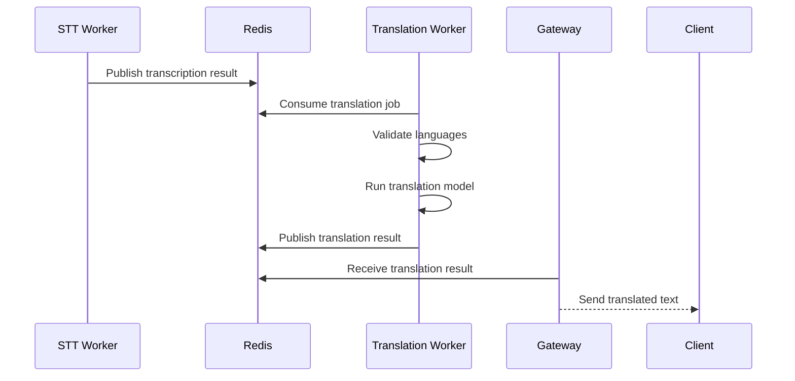

# Translation Worker Documentation

Complete guide to the Translation worker service - handles text translation using EasyNMT and other translation models.

## 🎯 Overview

The Translation Worker consumes transcription results from Redis and translates them into target languages. It supports multiple translation backends and provides efficient, scalable text translation with automatic language detection.

```
┌─────────────┐    ┌─────────────┐    ┌─────────────┐
│ STT Worker  │────│    Redis    │────│ Translation │
│ (Results)   │    │  (Pub/Sub)  │    │   Worker    │
└─────────────┘    └─────────────┘    └─────────────┘
                                              │
                                              ▼
                                 ┌─────────────────────┐
                                 │  Translated Text    │
                                 │  (Back to Client)   │
                                 └─────────────────────┘
```

## 🚀 Key Features

- **EasyNMT Integration**: Multiple translation model support
- **Language Detection**: Automatic source language identification
- **Batch Processing**: Efficient handling of multiple translation requests
- **Caching**: Translation result caching for performance
- **Memory Management**: Automatic garbage collection and resource cleanup
- **Health Monitoring**: Comprehensive metrics and status reporting
- **Error Handling**: Robust failure recovery and fallback mechanisms
- **Horizontal Scaling**: Consumer groups for load distribution

## 🏗️ Architecture

### Core Components

#### Worker Service (`worker.py`)
- Main orchestration and job processing loop
- Translation model initialization and management
- Redis consumer integration for job intake
- Result publishing and caching logic

#### Translation Engine (`translator.py`)
- Translation model loading and inference
- Language detection and validation
- Batch processing optimization
- Memory-efficient text processing

#### Model Manager (`model_manager.py`)
- Translation model lifecycle management
- GPU memory optimization
- Model switching and configuration

#### Result Publisher (`result_publisher.py`)
- Redis Pub/Sub result publishing
- Translation result formatting
- Client notification handling

## 🔄 Processing Pipeline

### Translation Flow



### Job Processing Steps

1. **Job Reception**: Consume translation job from Redis Pub/Sub
2. **Language Validation**: Verify source/target language support
3. **Text Preprocessing**: Clean and normalize input text
4. **Batch Formation**: Group compatible translations
5. **Model Inference**: Run translation using configured model
6. **Result Formatting**: Structure translation with metadata
7. **Publishing**: Send results via Redis Pub/Sub
8. **Caching**: Store results for future identical requests

## 🎛️ Configuration

### Model Settings

| Variable | Default | Description |
|----------|---------|-------------|
| `USE_STUB_TRANSLATION` | `true` | Use mock translation instead of real models (for development) |
| `EASYNMT_MODEL` | `opus-mt` | EasyNMT model for translation |
| `DEVICE` | `cpu` | Computing device (cpu, cuda) |

### Processing Options

| Variable | Default | Description |
|----------|---------|-------------|
| `MAX_BATCH_SIZE` | `8` | Maximum translations per batch |
| `CACHE_SIZE_MB` | `100` | Translation cache size limit |
| `MEMORY_CLEANUP_INTERVAL` | `300` | Memory cleanup interval (seconds) |

### System Settings

| Variable | Default | Description |
|----------|---------|-------------|
| `REDIS_URL` | `redis://localhost:6379` | Redis connection URL |
| `HEALTH_PORT` | `8082` | HTTP health check port |
| `LOG_LEVEL` | `INFO` | Logging verbosity level |

## 🌐 Supported Languages

### EasyNMT Models

The service supports various translation models through EasyNMT:

#### Opus-MT (Default)
- **Coverage**: 200+ language pairs
- **Quality**: Good for common language pairs
- **Speed**: Fast inference
- **Memory**: Moderate usage

#### M2M-100
- **Coverage**: 100 languages
- **Quality**: High for many-to-many translation
- **Speed**: Moderate
- **Memory**: High usage

#### MBart
- **Coverage**: 50+ languages
- **Quality**: Excellent for supported languages
- **Speed**: Slow but accurate
- **Memory**: Very high usage

### Language Pair Support

Common supported language pairs:
- English ↔ Spanish, French, German, Italian, Portuguese
- English ↔ Chinese, Japanese, Korean, Arabic
- English ↔ Russian, Turkish, Dutch, Polish
- And many more combinations

## ⚡ Performance Optimization

### Memory Management

The worker implements aggressive memory management:

```python
class TranslationWorker:
    def periodic_cleanup(self):
        # Force garbage collection
        gc.collect()

        # Clear translation cache if too large
        if self.cache.size_mb() > self.max_cache_size:
            self.cache.clear()

        # Unload unused models
        self.model_manager.unload_unused_models()
```

### Batch Processing

Translations are batched for efficiency:

```python
def process_batch(self, translations):
    # Group by source language
    batches = self.group_by_language(translations)

    for src_lang, batch in batches.items():
        # Run batch translation
        results = self.model.translate_batch(
            batch['texts'],
            src_lang=src_lang,
            tgt_lang=batch['target_lang']
        )
        # Process results
        self.publish_results(results, batch['jobs'])
```

### Caching Strategy

Translation results are cached to avoid redundant work:

```python
def get_translation(self, text, src_lang, tgt_lang):
    cache_key = f"{src_lang}:{tgt_lang}:{hash(text)}"

    # Check cache first
    if cache_key in self.cache:
        return self.cache[cache_key]

    # Perform translation
    result = self.model.translate(text, src_lang, tgt_lang)

    # Store in cache
    self.cache[cache_key] = result
    return result
```

## 📊 Monitoring and Metrics

### Health Endpoints

#### `/health`
```json
{
  "status": "healthy",
  "instance_id": "translation-001",
  "model_loaded": true,
  "model_name": "opus-mt",
  "device": "cpu",
  "jobs_processed": 38
}
```

#### `/metrics`
```json
{
  "jobs_processed": 38,
  "successful_translations": 36,
  "failed_translations": 2,
  "avg_translation_time_ms": 150,
  "text_chars_processed": 125000,
  "cache_hit_ratio": 0.75,
  "memory_peak_mb": 512
}
```

### Key Metrics

- **Throughput**: Translations processed per minute
- **Latency**: Average translation time
- **Cache Performance**: Hit ratio and efficiency
- **Memory Usage**: RAM consumption and cleanup events
- **Error Rates**: Failed translation attempts

## 🔧 Development and Testing

### Local Development
```bash
# Start with volume mounts
cd backend/infra
make up

# View translation worker logs
docker-compose logs -f translation_worker

# Test translation endpoint
curl http://localhost:8082/health
```

### Testing Translations
```bash
# Test translation via Redis
docker-compose exec redis redis-cli publish translations:client_123 '{"text":"Hello world","source_lang":"en","target_lang":"es"}'

# Check logs for processing
docker-compose logs -f translation_worker | grep "Translating"
```

### Model Testing
```bash
# Test model loading
docker run --rm translation-worker python -c "
from translator import TranslationModel
model = TranslationModel()
result = model.translate('Hello world', 'en', 'es')
print(f'Translation: {result}')
"

# Test language detection
docker run --rm translation-worker python -c "
from translator import TranslationModel
model = TranslationModel()
lang = model.detect_language('Bonjour le monde')
print(f'Detected language: {lang}')
"
```

## 🚀 Scaling and Deployment

### Horizontal Scaling
```bash
# Scale translation workers
docker-compose up --scale translation_worker=3

# Each worker joins consumer group
# Redis distributes jobs automatically
```

### Load Balancing Strategy

Workers consume from shared Redis channels:

```
Translation Jobs ── Consumer Group ── Translation Workers
     │                        │                │
     ├─ Job 1 ───────────── Consumer A ── Worker 1
     ├─ Job 2 ───────────── Consumer B ── Worker 2
     ├─ Job 3 ───────────── Consumer A ── Worker 1
     └─ Job 4 ───────────── Consumer C ── Worker 3
```

### Resource Requirements

| Model | CPU Cores | RAM | GPU Memory |
|-------|-----------|-----|------------|
| Opus-MT | 2 | 4GB | 1GB |
| M2M-100 | 4 | 8GB | 2GB |
| MBart | 8 | 16GB | 4GB |

## 🐛 Troubleshooting

### Common Issues

#### Model Loading Failures
```
Symptoms: "Model download failed"
Solutions:
- Check internet connectivity
- Use stub translation for development: USE_STUB_TRANSLATION=true
- Pre-download models manually
```

#### Memory Issues
```
Symptoms: "Out of memory" errors
Solutions:
- Reduce batch size: MAX_BATCH_SIZE=1
- Enable memory cleanup: MEMORY_CLEANUP_INTERVAL=60
- Monitor cache size: CACHE_SIZE_MB=50
```

#### Translation Quality Issues
```
Symptoms: Poor translation accuracy
Solutions:
- Switch models: EASYNMT_MODEL=m2m100
- Verify language pair support
- Check input text quality
```

#### High Latency
```
Symptoms: Slow translation response
Solutions:
- Scale more workers: docker-compose up --scale translation_worker=2
- Enable caching: increase CACHE_SIZE_MB
- Use batch processing: increase MAX_BATCH_SIZE
```

### Debug Commands
```bash
# Monitor translation jobs
docker-compose logs -f translation_worker | grep "Processing translation\|Translation completed"

# Check cache performance
docker-compose logs -f translation_worker | grep "cache\|Cache"

# Monitor memory usage
docker-compose logs -f translation_worker | grep "memory\|Memory"
```

## 🔧 Extending the Translation Worker

### Adding New Translation Models
```python
# In translator.py
class CustomTranslationModel:
    def __init__(self):
        self.model = self.load_custom_model()

    def translate(self, text, src_lang, tgt_lang):
        # Implement custom translation logic
        return translated_text

    def translate_batch(self, texts, src_lang, tgt_lang):
        # Implement batch translation
        return [self.translate(text, src_lang, tgt_lang) for text in texts]
```

### Custom Language Detection
```python
# In translator.py
def custom_language_detection(self, text):
    # Implement custom language detection
    # Return ISO language code
    return detected_lang
```

### Advanced Caching
```python
# In worker.py
class AdvancedCache:
    def __init__(self):
        self.cache = {}
        self.access_times = {}

    def get(self, key):
        if key in self.cache:
            self.access_times[key] = time.time()
            return self.cache[key]
        return None

    def put(self, key, value):
        # Implement LRU eviction
        if len(self.cache) >= self.max_size:
            self.evict_lru()
        self.cache[key] = value
        self.access_times[key] = time.time()
```

## 📊 Performance Benchmarks

### Model Performance Comparison

| Model | BLEU Score | Latency | Memory | Languages |
|-------|------------|---------|--------|-----------|
| Opus-MT | 25-35 | Fast | 2GB | 200+ pairs |
| M2M-100 | 20-30 | Medium | 4GB | 100 langs |
| MBart | 30-40 | Slow | 8GB | 50 langs |

### Throughput Examples

```
Opus-MT (CPU):    ~200 translations/minute
Opus-MT (GPU):    ~500 translations/minute
M2M-100 (GPU):    ~300 translations/minute
MBart (GPU):      ~100 translations/minute
```

*Throughput depends on text length, language pair, and hardware*

## 🔄 Development Workflow

### Making Changes
```bash
# Edit code (volume mounted)
# Changes reflect immediately
make restart

# Test changes
curl -X POST localhost:8082/health

# Check logs
make logs
```

### Testing Strategy
```bash
# Unit tests
cd backend/translation_worker
python -m pytest tests/

# Integration tests
cd backend/infra
docker-compose up -d
# Run test suite

# Load testing
cd backend/terminal_run
python demo_client.py --load-test --clients 5
```

## 📚 Related Documentation

- **[QUICK_START.md](../QUICK_START.md)** - Get running quickly
- **[CONFIGURATION.md](../CONFIGURATION.md)** - All configuration options
- **[DEVELOPMENT_SETUP.md](../DEVELOPMENT_SETUP.md)** - Development environment
- **[SHARED_MODULES.md](../SHARED_MODULES.md)** - Common utilities
- **[STT_WORKER.md](../STT_WORKER.md)** - STT worker details
