# WebSocket Client Guide

Complete guide to WebSocket communication between the frontend and backend services in the Nova Voice application.

## 🌐 WebSocket Architecture

The frontend communicates with the backend Gateway service via WebSocket for real-time audio streaming and transcription results.

```
┌─────────────────┐    ┌─────────────────┐    ┌─────────────────┐
│   Frontend      │────│   WebSocket     │────│   Gateway       │
│   (Electron)    │    │   Connection    │    │   Service       │
│                 │    │                 │    │                 │
│ • Audio Stream  │    │ • Binary Audio  │    │ • Audio Buffer  │
│ • Control Msgs  │    │ • JSON Control  │    │ • STT Jobs      │
│ • Results       │    │ • Results       │    │ • Translation   │
└─────────────────┘    └─────────────────┘    └─────────────────┘
```

## 🔌 Connection Management

### Connection Establishment

The WebSocket connection is managed by the Electron main process for security and reliability.

```javascript
// Main process (electron/main.js)
class WebSocketManager {
  constructor() {
    this.ws = null
    this.reconnectTimer = null
    this.reconnectAttempts = 0
    this.maxReconnectAttempts = 5
    this.reconnectDelay = 1000 // Start with 1 second
  }

  async connect(url) {
    try {
      this.ws = new WebSocket(url)

      this.ws.onopen = () => {
        console.log('[WS] Connected to gateway')
        this.reconnectAttempts = 0
        this.notifyRenderer('connection-status', { connected: true })
      }

      this.ws.onmessage = (event) => {
        this.handleMessage(event)
      }

      this.ws.onclose = (event) => {
        console.log('[WS] Connection closed:', event.code, event.reason)
        this.handleDisconnect()
      }

      this.ws.onerror = (error) => {
        console.error('[WS] Connection error:', error)
        this.handleDisconnect()
      }

    } catch (error) {
      console.error('[WS] Failed to create WebSocket:', error)
      throw error
    }
  }

  handleDisconnect() {
    this.notifyRenderer('connection-status', { connected: false })

    if (this.reconnectAttempts < this.maxReconnectAttempts) {
      this.scheduleReconnect()
    } else {
      console.error('[WS] Max reconnection attempts reached')
      this.notifyRenderer('connection-error', {
        error: 'Failed to reconnect to gateway'
      })
    }
  }

  scheduleReconnect() {
    this.reconnectAttempts++
    const delay = this.reconnectDelay * Math.pow(2, this.reconnectAttempts - 1)

    console.log(`[WS] Scheduling reconnect attempt ${this.reconnectAttempts} in ${delay}ms`)

    this.reconnectTimer = setTimeout(() => {
      this.connect(this.currentUrl)
    }, delay)
  }

  notifyRenderer(channel, data) {
    if (mainWindow && !mainWindow.isDestroyed()) {
      mainWindow.webContents.send(channel, data)
    }
  }
}
```

### React Hook Integration

The connection state is exposed to React components via a custom hook:

```typescript
// hooks/useConnection.ts
export function useConnection() {
  const [connected, setConnected] = useState(false)
  const [connecting, setConnecting] = useState(false)
  const [mode, setMode] = useState<'typing' | 'subtitle'>('typing')

  useEffect(() => {
    // Listen for connection status updates
    const unsubscribe = window.electronAPI.onConnectionStatus((event, data) => {
      setConnected(data.connected)
      setConnecting(false)
    })

    return unsubscribe
  }, [])

  const connect = async () => {
    setConnecting(true)
    try {
      const result = await window.electronAPI.connectGateway()
      if (!result.success) {
        throw new Error(result.error)
      }
      return result
    } catch (error) {
      setConnecting(false)
      throw error
    }
  }

  const setMode = async (newMode: 'typing' | 'subtitle') => {
    try {
      const result = await window.electronAPI.setMode(newMode)
      if (result.success) {
        setMode(newMode)
      }
      return result
    } catch (error) {
      console.error('Failed to set mode:', error)
      throw error
    }
  }

  return {
    connected,
    connecting,
    mode,
    connect,
    disconnect: () => window.electronAPI.disconnectGateway(),
    setMode
  }
}
```

## 📨 Message Formats

### Binary Audio Messages

Audio data is sent as binary WebSocket messages with metadata headers.

#### Message Structure
```
[4 bytes: metadata length][JSON metadata][binary audio data]
```

#### Metadata Format
```json
{
  "sampleRate": 16000,
  "channels": 1,
  "bitsPerSample": 16
}
```

#### Audio Data Format
- **Encoding**: 16-bit PCM (Linear PCM)
- **Channels**: Mono (1 channel)
- **Sample Rate**: 16kHz (optimized for speech recognition)
- **Endianness**: Little-endian

#### Sending Audio
```javascript
// Main process - audio transmission
function sendAudioChunk(audioBuffer, sampleRate) {
  if (!websocketManager.ws || websocketManager.ws.readyState !== WebSocket.OPEN) {
    console.warn('[WS] Cannot send audio: WebSocket not connected')
    return
  }

  // Convert Float32 to Int16
  const int16Array = new Int16Array(audioBuffer.length)
  for (let i = 0; i < audioBuffer.length; i++) {
    int16Array[i] = Math.max(-32768, Math.min(32767, audioBuffer[i] * 32768))
  }

  // Create metadata
  const metadata = JSON.stringify({
    sampleRate: sampleRate,
    channels: 1,
    bitsPerSample: 16
  })

  // Create binary message
  const metadataBytes = new TextEncoder().encode(metadata)
  const metadataLength = new Uint32Array([metadataBytes.length])
  const audioBytes = new Uint8Array(int16Array.buffer)

  // Combine: length + metadata + audio
  const message = new Uint8Array([
    ...new Uint8Array(metadataLength.buffer),
    ...metadataBytes,
    ...audioBytes
  ])

  websocketManager.ws.send(message)
  console.log(`[WS] Sent ${audioBytes.length} bytes of audio data`)
}
```

### JSON Control Messages

Text-based control messages use JSON format.

#### Outgoing Messages (Frontend → Gateway)

**Language Settings**
```json
{
  "type": "set_langs",
  "source_language": "en",
  "target_language": "vi"
}
```

**Status Request**
```json
{
  "type": "get_status"
}
```

**Start Over**
```json
{
  "type": "start_over"
}
```

#### Incoming Messages (Gateway → Frontend)

**Connection Status**
```json
{
  "type": "status",
  "client_id": "client_abc123",
  "source_language": "en",
  "target_language": "vi",
  "translation_enabled": true
}
```

**Real-time Transcription**
```json
{
  "type": "realtime",
  "text": "Hello world",
  "translation": "Hola mundo",
  "is_final": false,
  "client_id": "client_abc123",
  "timestamp": 1640995200.123
}
```

**Utterance End**
```json
{
  "type": "utterance_end",
  "client_id": "client_abc123",
  "timestamp": 1640995200.456
}
```

## 🔄 Message Flow Patterns

### Voice Typing Session

```mermaid
sequenceDiagram
    participant Frontend
    participant Gateway
    participant STT Worker
    participant Translation

    Frontend->>Gateway: WebSocket Connect
    Gateway-->>Frontend: status (connected)

    Frontend->>Gateway: set_langs (en→es)
    Gateway-->>Frontend: status (updated)

    Frontend->>Gateway: Audio Chunk 1 (binary)
    Gateway->>STT Worker: Job via Redis
    STT Worker->>Gateway: Result via Redis
    Gateway-->>Frontend: realtime (partial)

    Frontend->>Gateway: Audio Chunk 2 (binary)
    Gateway->>STT Worker: Job via Redis
    STT Worker->>Translation: Result via Redis
    Translation->>Gateway: Translation via Redis
    Gateway-->>Frontend: realtime (text + translation)

    Frontend->>Gateway: Audio Chunk 3 (final, binary)
    Gateway->>STT Worker: Final job via Redis
    STT Worker->>Translation: Final result via Redis
    Translation->>Gateway: Final translation via Redis
    Gateway-->>Frontend: realtime (final)
    Gateway-->>Frontend: utterance_end
```



### Live Subtitles Session


## 🎛️ Connection States

### State Management

The WebSocket connection goes through several states:

```typescript
enum ConnectionState {
  DISCONNECTED = 'disconnected',
  CONNECTING = 'connecting',
  CONNECTED = 'connected',
  RECONNECTING = 'reconnecting',
  ERROR = 'error'
}
```

### State Transitions

```javascript
class ConnectionStateManager {
  constructor() {
    this.state = ConnectionState.DISCONNECTED
    this.listeners = []
  }

  setState(newState, data = {}) {
    console.log(`[WS] State: ${this.state} → ${newState}`, data)
    this.state = newState

    // Notify React components
    this.listeners.forEach(callback => callback(newState, data))
  }

  onStateChange(callback) {
    this.listeners.push(callback)
    return () => {
      const index = this.listeners.indexOf(callback)
      if (index > -1) this.listeners.splice(index, 1)
    }
  }
}

// Usage
const stateManager = new ConnectionStateManager()

// Connect
stateManager.setState(ConnectionState.CONNECTING)
try {
  await websocket.connect(url)
  stateManager.setState(ConnectionState.CONNECTED)
} catch (error) {
  stateManager.setState(ConnectionState.ERROR, { error })
}
```

## 🔄 Automatic Reconnection

### Exponential Backoff Strategy

```javascript
class ReconnectionManager {
  constructor() {
    this.attempts = 0
    this.maxAttempts = 10
    this.baseDelay = 1000 // 1 second
    this.maxDelay = 30000 // 30 seconds
    this.timer = null
  }

  scheduleReconnect() {
    if (this.attempts >= this.maxAttempts) {
      console.error('[WS] Max reconnection attempts reached')
      return false
    }

    this.attempts++

    // Exponential backoff with jitter
    const delay = Math.min(
      this.baseDelay * Math.pow(2, this.attempts - 1),
      this.maxDelay
    )

    // Add random jitter (±25%)
    const jitter = delay * 0.25 * (Math.random() * 2 - 1)
    const finalDelay = Math.floor(delay + jitter)

    console.log(`[WS] Reconnecting in ${finalDelay}ms (attempt ${this.attempts})`)

    this.timer = setTimeout(() => {
      this.attemptReconnect()
    }, finalDelay)

    return true
  }

  async attemptReconnect() {
    try {
      await websocket.connect(this.url)
      console.log('[WS] Reconnected successfully')
      this.attempts = 0 // Reset on success
    } catch (error) {
      console.error('[WS] Reconnection failed:', error)
      this.scheduleReconnect()
    }
  }

  reset() {
    this.attempts = 0
    if (this.timer) {
      clearTimeout(this.timer)
      this.timer = null
    }
  }
}
```

### Connection Quality Monitoring

```javascript
class ConnectionMonitor {
  constructor() {
    this.pingInterval = 30000 // 30 seconds
    this.pingTimeout = 5000   // 5 seconds
    this.lastPong = Date.now()
    this.intervalId = null
  }

  start() {
    this.intervalId = setInterval(() => {
      this.sendPing()
    }, this.pingInterval)
  }

  sendPing() {
    if (websocket.readyState === WebSocket.OPEN) {
      websocket.send(JSON.stringify({ type: 'ping', timestamp: Date.now() }))

      // Set timeout for pong response
      setTimeout(() => {
        if (Date.now() - this.lastPong > this.pingTimeout) {
          console.warn('[WS] Ping timeout - connection may be unstable')
          // Trigger reconnection if needed
          websocket.close()
        }
      }, this.pingTimeout)
    }
  }

  handlePong() {
    this.lastPong = Date.now()
  }

  stop() {
    if (this.intervalId) {
      clearInterval(this.intervalId)
      this.intervalId = null
    }
  }
}
```

## 📊 Message Handling

### Incoming Message Router

```javascript
class MessageHandler {
  constructor() {
    this.handlers = new Map()
  }

  register(type, handler) {
    this.handlers.set(type, handler)
  }

  async handle(message) {
    try {
      const data = JSON.parse(message)

      if (data.type === 'pong') {
        connectionMonitor.handlePong()
        return
      }

      const handler = this.handlers.get(data.type)
      if (handler) {
        await handler(data)
      } else {
        console.warn('[WS] Unhandled message type:', data.type)
      }
    } catch (error) {
      console.error('[WS] Failed to handle message:', error, message)
    }
  }
}

// Register handlers
messageHandler.register('status', (data) => {
  // Update connection status
  updateStatus(data)
})

messageHandler.register('realtime', (data) => {
  // Handle transcription result
  handleTranscription(data)
})

messageHandler.register('utterance_end', (data) => {
  // Handle utterance completion
  handleUtteranceEnd(data)
})
```

### Error Handling

```javascript
class ErrorHandler {
  static handleWebSocketError(error) {
    console.error('[WS] WebSocket error:', error)

    // Categorize error types
    if (error.code === 1006) {
      // Abnormal closure - network issue
      scheduleReconnect()
    } else if (error.code === 1008) {
      // Policy violation - configuration issue
      showConfigurationError()
    } else {
      // Generic error handling
      showGenericError()
    }
  }

  static handleMessageError(error, rawMessage) {
    console.error('[WS] Message processing error:', error)

    // Log problematic message for debugging
    console.error('[WS] Raw message:', rawMessage)

    // Continue processing other messages
    // Don't break the connection for message errors
  }
}
```

## 🔧 Development and Testing

### WebSocket Debugging

```javascript
// Enable detailed WebSocket logging
const DEBUG_WEBSOCKET = process.env.DEBUG_WEBSOCKET === 'true'

class WebSocketDebugger {
  static logConnection(url) {
    if (DEBUG_WEBSOCKET) {
      console.log(`[WS] Connecting to: ${url}`)
    }
  }

  static logMessage(direction, type, data) {
    if (DEBUG_WEBSOCKET) {
      console.log(`[WS] ${direction} ${type}:`, JSON.stringify(data, null, 2))
    }
  }

  static logBinaryMessage(direction, size) {
    if (DEBUG_WEBSOCKET) {
      console.log(`[WS] ${direction} binary: ${size} bytes`)
    }
  }
}

// Usage
WebSocketDebugger.logConnection(url)
WebSocketDebugger.logMessage('→', 'set_langs', { source_language: 'en' })
WebSocketDebugger.logBinaryMessage('→', audioData.length)
```

### Testing WebSocket Connections

```javascript
// Manual WebSocket testing
function testWebSocketConnection(url) {
  return new Promise((resolve, reject) => {
    const ws = new WebSocket(url)

    ws.onopen = () => {
      console.log('✅ WebSocket connected')
      ws.send(JSON.stringify({ type: 'get_status' }))
    }

    ws.onmessage = (event) => {
      console.log('✅ Received message:', event.data)
      ws.close()
      resolve()
    }

    ws.onerror = (error) => {
      console.error('❌ WebSocket error:', error)
      reject(error)
    }

    ws.onclose = (event) => {
      console.log('✅ WebSocket closed:', event.code)
    }

    // Timeout after 10 seconds
    setTimeout(() => {
      ws.close()
      reject(new Error('Connection timeout'))
    }, 10000)
  })
}

// Usage
testWebSocketConnection('ws://localhost:5026')
  .then(() => console.log('All tests passed'))
  .catch(error => console.error('Test failed:', error))
```

### Mock WebSocket for Testing

```javascript
class MockWebSocket {
  constructor(url) {
    this.url = url
    this.readyState = WebSocket.CONNECTING
    this.mockResponses = []
  }

  addMockResponse(type, data) {
    this.mockResponses.push({ type, data })
  }

  connect() {
    setTimeout(() => {
      this.readyState = WebSocket.OPEN
      this.onopen()

      // Send mock responses
      this.mockResponses.forEach(response => {
        setTimeout(() => {
          this.onmessage({ data: JSON.stringify(response) })
        }, Math.random() * 1000)
      })
    }, 100)
  }

  send(data) {
    console.log('[MOCK WS] Sent:', data)
  }

  close() {
    this.readyState = WebSocket.CLOSED
    this.onclose()
  }
}

// Usage in tests
const mockWs = new MockWebSocket('ws://test')
mockWs.addMockResponse('status', { connected: true })
mockWs.addMockResponse('realtime', { text: 'Hello world' })
```

## 📈 Performance Optimization

### Message Batching

```javascript
class MessageBatcher {
  constructor(delay = 100) {
    this.delay = delay
    this.queue = []
    this.timer = null
  }

  addMessage(message) {
    this.queue.push(message)

    if (!this.timer) {
      this.timer = setTimeout(() => {
        this.flush()
      }, this.delay)
    }
  }

  flush() {
    if (this.queue.length > 0) {
      // Send all queued messages
      const batch = [...this.queue]
      this.queue = []
      this.sendBatch(batch)
    }

    this.timer = null
  }

  sendBatch(messages) {
    // Combine multiple messages into single WebSocket frame
    const combined = messages.map(msg => JSON.stringify(msg)).join('\n')
    websocket.send(combined)
  }
}
```

### Connection Pooling

```javascript
class WebSocketPool {
  constructor(size = 3) {
    this.size = size
    this.connections = []
    this.currentIndex = 0
  }

  async connect(url) {
    for (let i = 0; i < this.size; i++) {
      const ws = new WebSocket(url)
      await this.waitForConnection(ws)
      this.connections.push(ws)
    }
  }

  getConnection() {
    const connection = this.connections[this.currentIndex]
    this.currentIndex = (this.currentIndex + 1) % this.connections.length
    return connection
  }

  async sendAudio(audioData) {
    const ws = this.getConnection()
    if (ws.readyState === WebSocket.OPEN) {
      ws.send(audioData)
    }
  }
}
```

## 🐛 Troubleshooting

### Connection Issues

**WebSocket Connection Refused**
```
Error: ECONNREFUSED
Solution: Check if Gateway service is running on correct port
```

**WebSocket Connection Timeout**
```
Error: Connection timeout
Solution: Check network connectivity and firewall settings
```

**WebSocket Protocol Error**
```
Error: Invalid protocol
Solution: Ensure correct WebSocket URL (ws:// or wss://)
```

### Message Issues

**Messages Not Received**
```
Check: WebSocket readyState is OPEN
Check: Message handlers are registered
Check: JSON parsing is valid
```

**Binary Messages Corrupted**
```
Check: Metadata length field is correct
Check: Audio data format matches expectations
Check: Endianness is little-endian
```

**High Latency**
```
Check: Network round-trip time
Check: Message processing time
Check: Server-side queuing delays
Check: WebSocket buffer sizes
```

### Performance Issues

**Memory Leaks**
```javascript
// Monitor WebSocket message listeners
const listenerCount = websocket.listenerCount('message')
console.log(`Message listeners: ${listenerCount}`)

// Clean up event listeners
websocket.removeAllListeners('message')
```

**Connection Instability**
```javascript
// Monitor connection health
setInterval(() => {
  console.log(`WebSocket state: ${websocket.readyState}`)
  console.log(`Buffered messages: ${websocket.bufferedAmount}`)
}, 10000)
```

## 📚 Related Documentation

- **[DEVELOPMENT_SETUP.md](DEVELOPMENT_SETUP.md)** - Development workflow
- **[ELECTRON_INTEGRATION.md](ELECTRON_INTEGRATION.md)** - Electron main process
- **[API_REFERENCE.md](../backend/docs/API_REFERENCE.md)** - Complete API reference
- **[CONFIGURATION.md](CONFIGURATION.md)** - Connection settings

---

**WebSocket communication forms the real-time backbone of the application, enabling seamless audio streaming and instant transcription results.**
